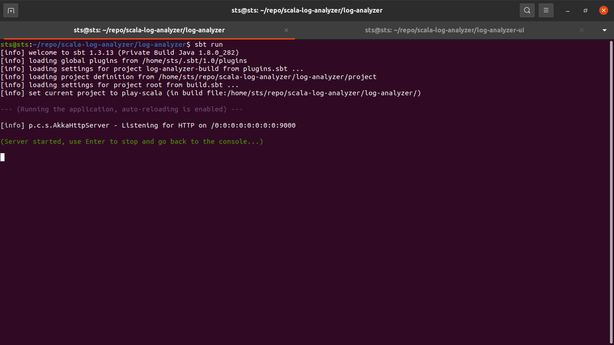
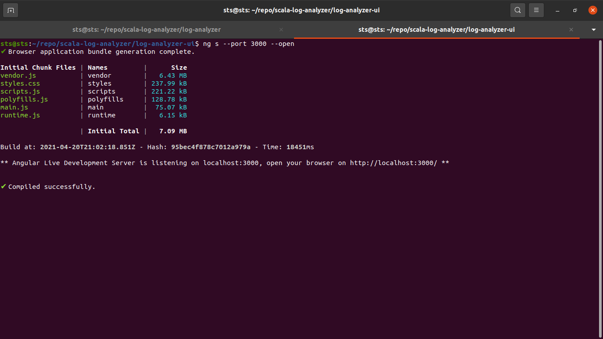
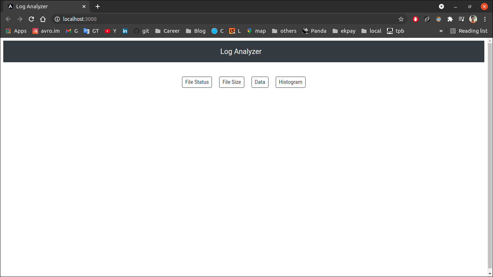
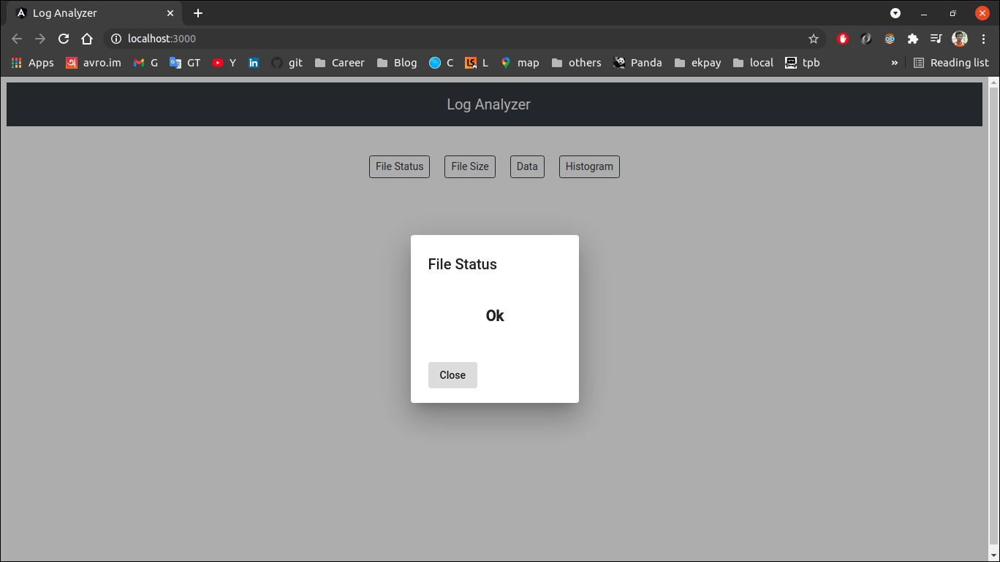
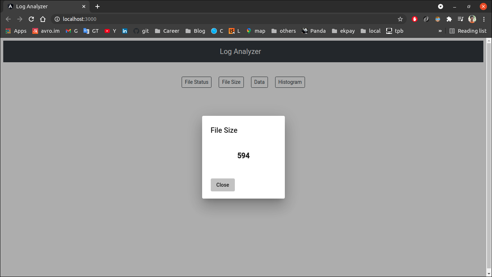
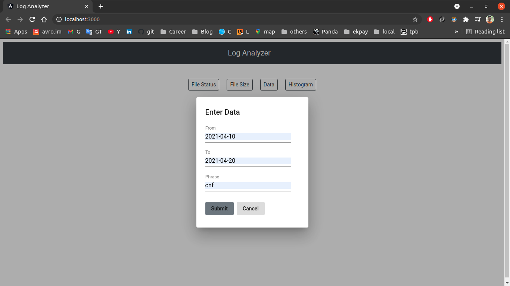
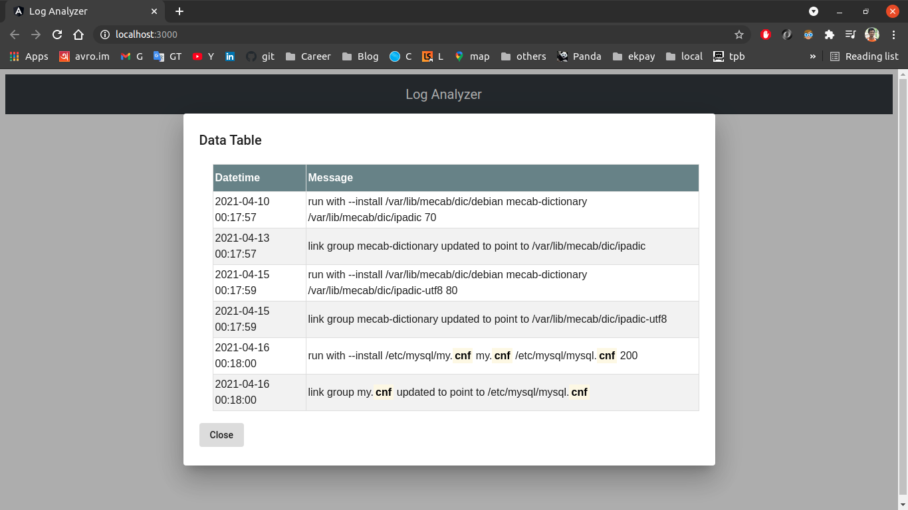
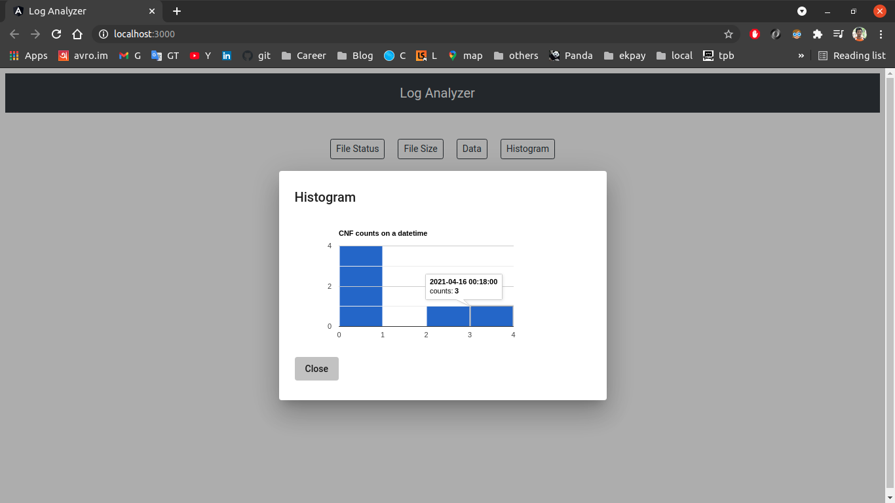

# Features of the application
- Check status of a log file
- Get the size of the file
- View highlighted phrase between a date range
- Generate histogram by a phase occurrence between a date range

# Technologies used
- Scala
- Play framework [Web application framework written in Scala]
- Akka Http Server [Play framework uses the Akka HTTP Server to handle HTTP requests and responses by default]
- Angular 11
- Angular Google Charts [To generate Histogram]

# Run the Application

## System configuration prerequisites

### 1. First, make sure you have the Java 8 JDK (or Java 11 JDK) installed.

### 2. Then, install Scala by installing sbt, Scala's build tool.
Check this for [Complete Installation](https://www.scala-lang.org/download/)

### 3. Install Node, Angular and Angular CLI
In my system the versions are
````   
Node: 10.19.0
Angular: 11.2.10
Angular CLI: 11.2.9
````

### 4. Create ```/var/log/messages``` log file in your linux system
For this application I considered I have a log file named **messages** inside ``/var/log`` of my Ubuntu system 
having log right now 
````
2021-04-10 00:17:57: run with --install /var/lib/mecab/dic/debian mecab-dictionary /var/lib/mecab/dic/ipadic 70
2021-04-13 00:17:57: link group mecab-dictionary updated to point to /var/lib/mecab/dic/ipadic
2021-04-15 00:17:59: run with --install /var/lib/mecab/dic/debian mecab-dictionary /var/lib/mecab/dic/ipadic-utf8 80
2021-04-15 00:17:59: link group mecab-dictionary updated to point to /var/lib/mecab/dic/ipadic-utf8
2021-04-16 00:18:00: run with --install /etc/mysql/my.cnf my.cnf /etc/mysql/mysql.cnf 200
2021-04-16 00:18:00: link group my.cnf updated to point to /etc/mysql/mysql.cnf
````
Look, a line containing the log datetime following the log message. The log analysis will happen on it. For this 
development I have considered there is just 6 lines of log but in a production application have to process millions 
of log.

### 5. Clone ```scala-log-analyzer``` repository
Open terminal and run command
````
git clone https://github.com/hnjaman/scala-log-analyzer.git
````
In your current directory ``scala-log-analyzer`` directory will be created with two separate project inside it 
as ``log-analyzer`` for backend server and ``log-analyzer-ui`` for user interface.

## Run log-analyzer application
Open terminal and run below command from ``log-analyzer`` directory
````
sbt run
````


The application will run in 9000 port. If you visit http://localhost:9000 in your browser you will see a welcome page
which is generated by play framework by default when a play project created. This is not necessary here so skip it.  

### API details of log-analyzer application

| API              | REST Method   | API endpoints                                |
|------------------|:--------------|:---------------------------------------------|
|Get status        |GET            |``http://localhost:9000/api/get_status``      |
|Get log file size |GET            |``http://localhost:9000/api/get_size``        |
|Get data          |POST           |``http://localhost:9000/api/data``            |
|Get histogram     |POST           |``http://localhost:9000/api/histogram``       |


## Run log-analyzer-ui application
Open terminal and run below command from ``log-analyzer-ui`` directory
````
npm install
ng s --port 3000 --open
````


It will open a new tab in your browser with http://localhost:3000 url as frontend application, and you will see



### Check File Status
If you press ``File Status`` button it will call **Get status** API and you will see **Ok** in a popup if you have log 
file ``/var/log/message`` otherwise **Not exists**.  



### Check File Size
If you press ``File Size`` button it will call **Get log file size** API and you will see the numeric value of the file 
in a popup if you have log file ``/var/log/message``. If file not exists the numeric value will be zero.




### View highlighted phrase between a date range
If you press ``Data`` button it will open the Enter Data popup



Fill the From and To input field by yyyy-mm-dd format date as your searching date range and put what word or sentence 
in Phrase as what you want to search then press Submit button. The Submit button will call **Get data** API and you will
see a popup with your searched phrase between the date range of the log file. Look in my case **cnf** is highlighted 
3 times and 2 times of two separate time at 2021-04-16.



### Generate histogram by a phase occurrence between a date range
If you press ``Histogram`` button it will open the same Enter Data popup and fill up as before and press Submit button. 
The Submit button will call **Get histogram** API and you will see a popup with the histogram for your searched phrase 
between the date range of the log file.



If you hover your cursor to the blue block on the histogram you see datetime and phrase occurrence counts of that datetime.


###### THE END

# Copyright & License

MIT License, see the link: [LICENSE](https://github.com/hnjaman/scala-log-analyzer/blob/main/LICENSE) 
file for details.